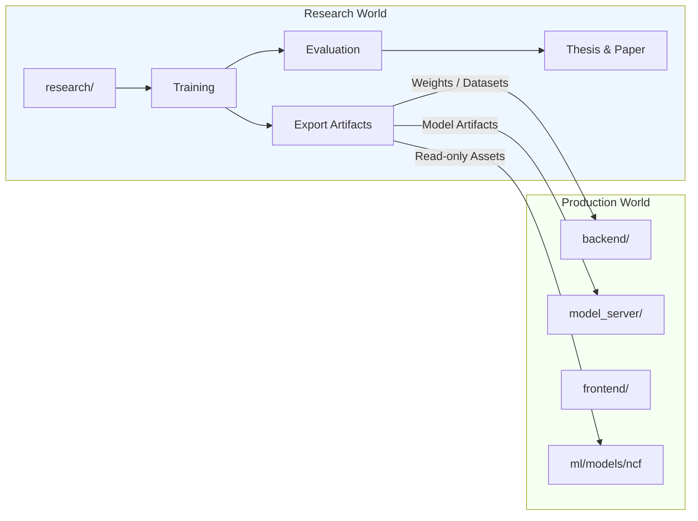
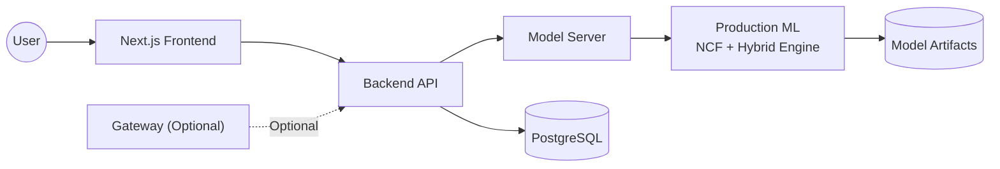
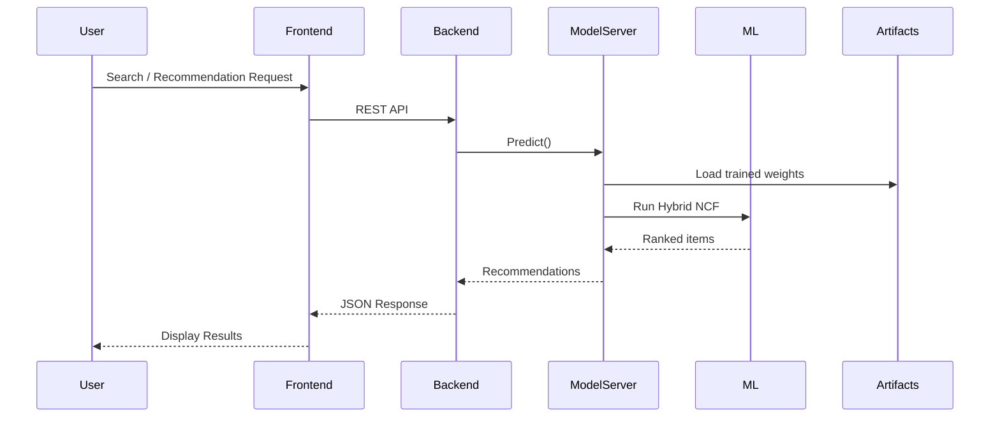
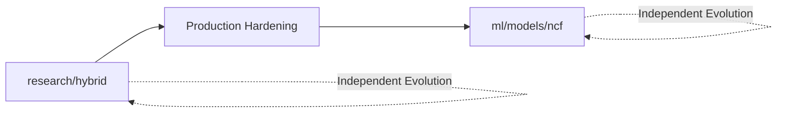
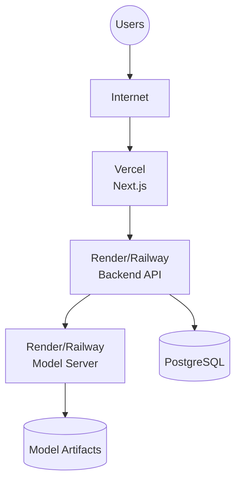
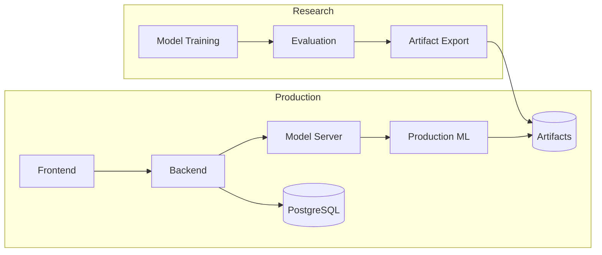

# Architecture Overview

This document outlines the system architecture using Mermaid diagrams for clarity and conciseness. The design intentionally separates two independent worlds that never import from each other: `research/` and `production/`.

## Two-World Boundary

```text
research/    ──export_model.py / promote_dataset.py (planned)──►   production
   (never imported by production)                     (never imports research)
```

### Research → Production Boundary



**Rule:** Production never imports research code. Research only exports artifacts.

`research/` exists to produce artifacts: trained weights, processed datasets, evaluation results, the thesis, and the IEEE paper. It optimizes for reproducibility and experimentation speed, not runtime performance or API stability.

`production/` (`production/backend/`, `production/recommenders/`, `production/serving/`, `production/frontend/`, `production/gateway-optional/`) exists to serve those artifacts to real users. It optimizes for correctness, latency, and operability.

This split was verified in the Phase 1 audit by checking every `import` statement in the codebase — see [docs/decisions/0001-research-production-separation.md](docs/decisions/0001-research-production-separation.md).

### Component Map

| Component             | Responsibility                                        | Talks to                                     |
| --------------------- | ----------------------------------------------------- | -------------------------------------------- |
| `production/frontend` | Next.js UI                                            | `backend` (REST)                             |
| `backend`             | Auth, search, user data, orchestrates recommendations | `model_server`, Postgres                     |
| `model_server`        | Loads trained NCF/hybrid weights, serves predictions  | `ml` (in-process), `artifacts/ml/models/ncf` |
| Production ML Engine  | Hybrid engine code (no training)                      | `artifacts/` (read-only)                     |
| `research/*`          | Training, experimentation, evaluation, thesis, paper  | Nothing in production                        |

### Production Component Architecture



### Request Flow



## Why the Hybrid Engine Has Two Copies (`research/` vs. `production/`)

Both `research/hybrid/` and `ml/models/ncf/` define `HybridEngine` and `ColdStartHandler`. This is **not accidental duplication**. The production version is a deliberate, hardened refactor of the research version (see [ADR 0002](docs/decisions/0002-hybrid-engine-hardening.md)).

### Evolution of the Hybrid Engine



They are allowed to evolve independently. Future contributors **should not merge them into a shared module**, as doing so would reintroduce coupling between research and production.

## Deployment Target

The primary deployment target is a **free-tier PaaS**:

- **Backend** → Render / Railway
- **Model Server** → Render / Railway
- **Frontend** → Vercel

Kubernetes and Terraform remain future deployment options.

### Deployment Architecture



## Repository Architecture Overview

This diagram summarizes the complete architecture.



## Further Reading

- [docs/architecture/overview.md](docs/architecture/overview.md) — deeper narrative walkthrough
- [docs/decisions/](docs/decisions/) — ADRs for specific architectural choices
- [docs/diagrams/system-architecture.md](docs/diagrams/system-architecture.md) — request-flow diagram
