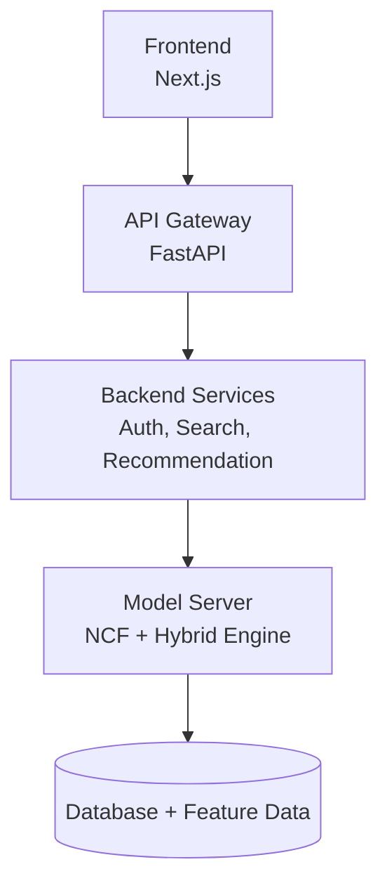

# Neural Collaborative Filtering (NCF) Recommender System

[](.github/workflows/ci.yaml)
[](LICENSE)
[](https://ncf-frontend.vercel.app/)
[](https://rahulkp-ai.github.io/NCF-Recommender-System/research/comparisons/dashboard/)

## Overview

A **production-grade, end-to-end hybrid recommendation system** that combines:

- Neural Collaborative Filtering (NCF)
- Content-based filtering
- Popularity-based recommendations

This project bridges **deep learning theory → scalable system design → real-world deployment**.

---

## Key Highlights

- Built **NCF from scratch (NumPy)** to demonstrate mathematical understanding
- Optimized with **PyTorch (GPU/MPS support)** for production performance
- Solved **cold-start problem** using hybrid recommendation strategy
- Designed **microservice architecture** with FastAPI + Next.js
- Deployed using **Docker + Nginx**
- Includes **research pipeline + evaluation metrics + visualizations**

---

## System Architecture



---

## Tech Stack

### Frontend

- Next.js
- TypeScript
- Tailwind CSS

### Backend

- FastAPI
- SQLAlchemy
- Pydantic

### Machine Learning

- NumPy (NCF from scratch)
- PyTorch (optimized NCF)
- Hybrid Recommendation Engine

### Research & Evaluation

- Jupyter Notebooks
- Matplotlib / Visualization
- Custom Metrics (Hit@K, NDCG@K)

### DevOps & Deployment

- Docker
- Docker Compose
- Nginx

---

## Project Structure

```bash
NCF-Recommender-System/
│
├── production/
│   ├── frontend/          # Next.js frontend (was apps/web/)
│   ├── backend/           # FastAPI backend (unchanged internals)
│   ├── serving/           # ML inference service (was model_server/)
│   ├── recommenders/      # NCF + hybrid + content + popularity (was ml/models/ncf/)
│   ├── gateway-optional/  # Optional JWT proxy (was gateway/, not wired in by default)
│   ├── artifacts/         # Trained model weights + engines (was artifacts/ + data/processed/)
│   └── tests/             # Unit/integration/e2e tests (was tests/)
├── research/              # Experiments, evaluation, datasets (was research/ + data/)
├── deployment/            # Docker, nginx, k8s/terraform (reference), monitoring (was infra/)
├── thesis/                # Phase-wise documentation
├── ieee/                  # Published paper
└── docs/                  # Architecture, ADRs, deployment & developer guides
```

See `ARCHITECTURE.md` for the full component map and
`docs/decisions/0003-recommenders-serving-rename.md` for why folders were
renamed rather than just moved.

---

## Features

### Recommendation Engine

- Personalized recommendations using NCF
- Hybrid fallback for cold-start users
- Real-time inference via model server

### Search System

- Movie search with ranking
- Integrated with recommendation pipeline

### User System

- Authentication (login/signup)
- Interaction tracking

### Evaluation

- Hit@10
- NDCG@10
- Training loss comparison

---

## Model Performance

| Metric   | Scratch NCF | PyTorch NCF |
| -------- | ----------- | ----------- |
| BCE Loss | 0.6133      | 0.6111      |
| Hit@10   | 0.6279      | 0.6293      |
| NDCG@10  | —           | 0.3541      |

---

## Research Contributions

- Implemented **NCF from first principles** (forward + backward pass)
- Verified **gradient correctness** via testing
- Compared **NumPy vs PyTorch performance**
- Designed **hybrid recommendation architecture**

---

## 🐳 Running the Project

### 1️⃣ Clone Repository

```bash
git clone https://github.com/rahulkp-ai/NCF-Recommender-System.git
cd NCF-Recommender-System
```

### Setup Environment

```bash
cp .env.example .env
```

### Run with Docker

```bash
docker compose up --build
```

### Access Application

- Frontend: [http://localhost:3000](http://localhost:3000)
- Backend API: [http://localhost:8000](http://localhost:8000) (docs at `/docs`)
- Model server: [http://localhost:8001/health](http://localhost:8001/health)

---

## Running Tests

```bash
pytest
```

---

## Future Improvements

Already done as of this repository's hardening pass — kept here only to show what moved from "future"
to "shipped": CI/CD pipeline (`.github/workflows/`), basic monitoring
(`/metrics`endpoints +`deployment/monitoring/prometheus/`).

Genuinely still future — see `ROADMAP.md` for the full list and the
specific trigger condition for each:

- Feature Store integration
- Real-time streaming (Kafka)
- Online learning
- Deployed, publicly-accessible instance (target: Render/Railway +
  Vercel free tiers — see `docs/deployment/README.md`)

## Documentation

- `ARCHITECTURE.md` — component map and request-flow
- `docs/decisions/` — architecture decision records (ADRs)
- `docs/deployment/README.md` — free-tier deployment plan
- `docs/developer-guide/getting-started.md` — full local setup
- `CONTRIBUTING.md`, `SECURITY.md`, `CODE_OF_CONDUCT.md` — project governance

---

## Use Cases

- Movie recommendation platforms
- E-commerce personalization
- Content discovery systems

---

## Author

**RAHUL KP KURUP**

- MSc Computer Science
- AI/ML Engineer (Aspiring)

---

## Final Note

This project demonstrates:

- Deep understanding of recommendation systems
- Strong ML fundamentals
- Production-level engineering skills
