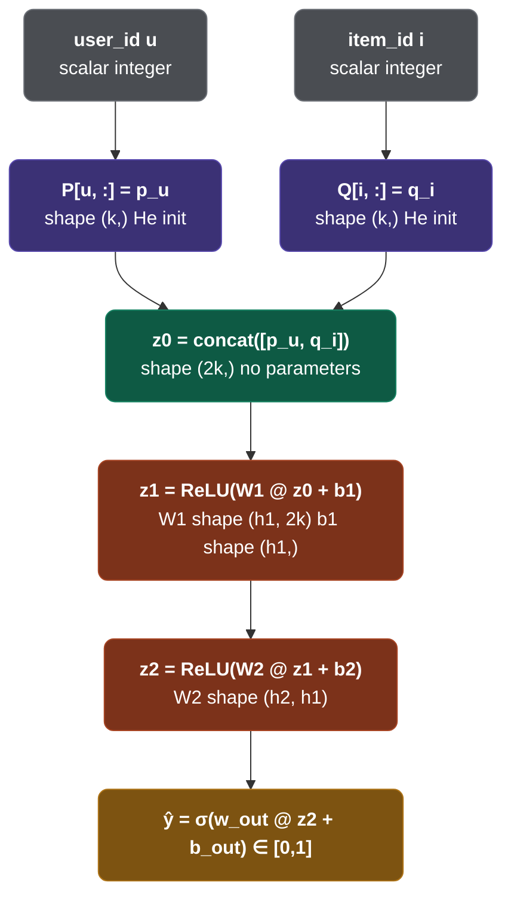

```mermaid
graph TD
    %% Nodes definition
    user_id["<b>user_id u</b><br/>scalar integer"]
    item_id["<b>item_id i</b><br/>scalar integer"]

    P_u["<b>P[u, :] = p_u</b><br/>shape (k,) He init"]
    Q_i["<b>Q[i, :] = q_i</b><br/>shape (k,) He init"]

    z0["<b>z0 = concat([p_u, q_i])</b><br/>shape (2k,) no parameters"]

    z1["<b>z1 = ReLU(W1 @ z0 + b1)</b><br/>W1 shape (h1, 2k) b1 shape (h1,)"]

    z2["<b>z2 = ReLU(W2 @ z1 + b2)</b><br/>W2 shape (h2, h1)"]

    y_hat["<b>ŷ = σ(w_out @ z2 + b_out) ∈ [0,1]</b>"]

    %% Connections
    user_id --> P_u
    item_id --> Q_i

    P_u --> z0
    Q_i --> z0

    z0 --> z1
    z1 --> z2
    z2 --> y_hat

    %% Styling
    classDef inputStyle fill:#4A4D52,stroke:#6C7077,color:#FFFFFF,rx:8px,ry:8px;
    classDef embedStyle fill:#3B3175,stroke:#5849AD,color:#FFFFFF,rx:8px,ry:8px;
    classDef concatStyle fill:#0E5A44,stroke:#178363,color:#FFFFFF,rx:8px,ry:8px;
    classDef denseStyle fill:#7C321A,stroke:#A84524,color:#FFFFFF,rx:8px,ry:8px;
    classDef outputStyle fill:#7D5311,stroke:#B07518,color:#FFFFFF,rx:8px,ry:8px;

    class user_id,item_id inputStyle;
    class P_u,Q_i embedStyle;
    class z0 concatStyle;
    class z1,z2 denseStyle;
    class y_hat outputStyle;

```
