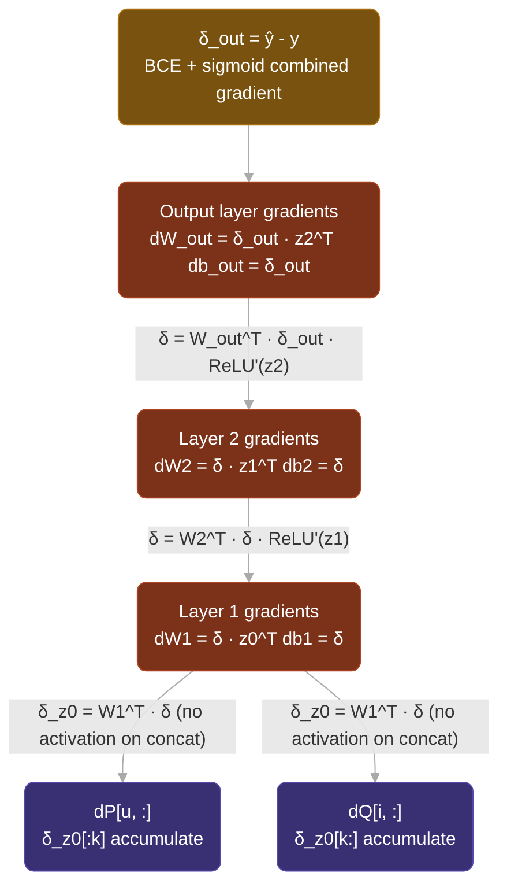

```mermaid
graph TD
    %% Node Definitions

    delta_out("δ_out = ŷ - y<br>BCE + sigmoid combined gradient"):::outputLayer

    output_layer("Output layer gradients<br>dW_out = δ_out · z2^T   db_out = δ_out"):::denseLayer

    layer_2("Layer 2 gradients<br>dW2 = δ · z1^T   db2 = δ"):::denseLayer

    layer_1("Layer 1 gradients<br>dW1 = δ · z0^T   db1 = δ"):::denseLayer

    dp_u("dP[u, :]<br>δ_z0[:k] accumulate"):::embedLayer

    dq_i("dQ[i, :]<br>δ_z0[k:] accumulate"):::embedLayer

    %% Connections

    delta_out --> output_layer
    output_layer -- "δ = W_out^T · δ_out · ReLU'(z2)" --> layer_2
    layer_2 -- "δ = W2^T · δ · ReLU'(z1)" --> layer_1
    layer_1 -- "δ_z0 = W1^T · δ (no activation on concat)" --> dp_u

    layer_1 -- "δ_z0 = W1^T · δ (no activation on concat)" --> dq_i

    %% Formatting
    linkStyle default fill:none,stroke:#AAAAAA,stroke-width:1px;

    classDef outputLayer fill:#7A5210,stroke:#B57816,color:#FFFFFF,rx:8,ry:8;
    classDef denseLayer fill:#7C3119,stroke:#B24624,color:#FFFFFF,rx:8,ry:8;
    classDef embedLayer fill:#393074,stroke:#5548AD,color:#FFFFFF,rx:8,ry:8;

    %% Key for Text
    %% P[u, :] is the user embedding vector for user u.
    %% Q[i, :] is the item embedding vector for item i.
    %% z0 is the concatenated input vector to Layer 1.
    %% k is the embedding dimension.

    %% Text Note (Place outside the main graph)
    %% Note1("Embedding gradients are sparse — only rows u and i are updated each step.<br>This is the key efficiency advantage of embedding layers over dense layers.")

```
